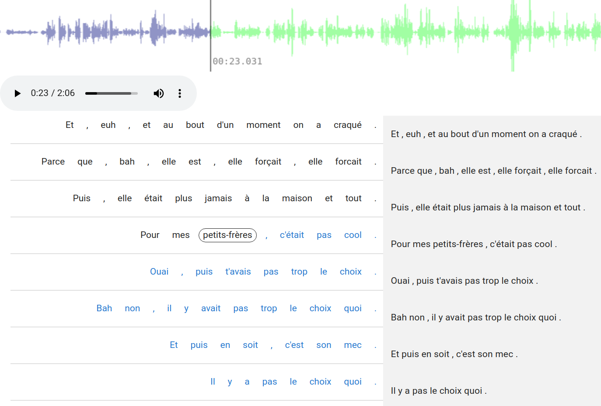

# Klang 

Klang is the module for the correction of transcriptions.




## datapreparation

praat files to conll files

only used if new data is added

## djangoklang

```
cd djangoklang

virtualenv klangenv
source klangenv/bin/activate 
python3 -m pip install --upgrade pip
python3 -m pip install django djangorestframework django-cors-headers markdown tqdm

python manage.py migrate
python manage.py createsuperuser --email x@example.com --username admin

python3 manage.py runserver
```

## quasarklang

```
cd quasarklang

npm install --save vue-audio-visual
npm install
sudo npm install -g @quasar/cli

quasar dev
```

we only use AvWaveform from https://github.com/staskobzar/vue-audio-visual. Ideally, only the necessary files of vue-audio-visual will directly be integrated.

